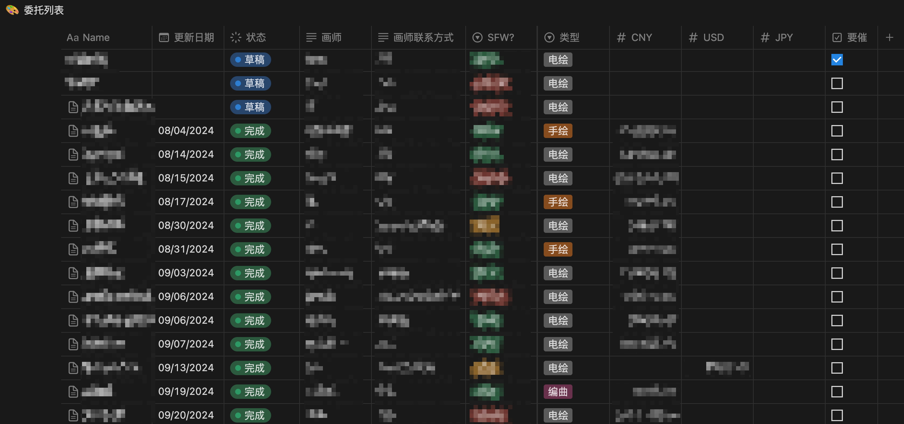
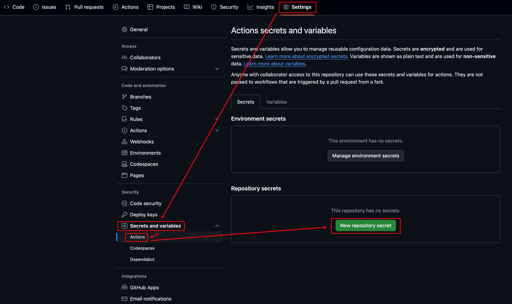
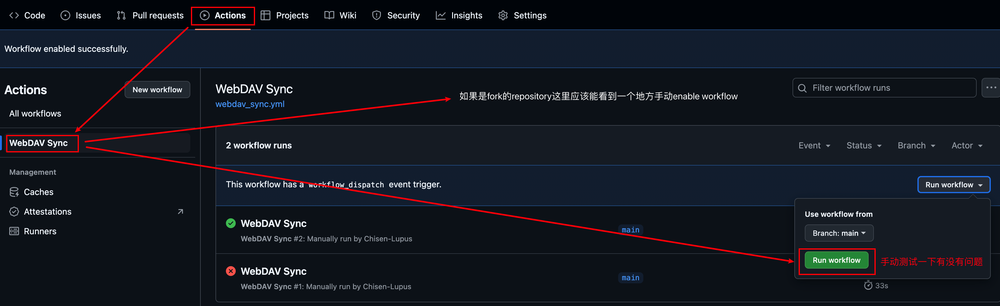
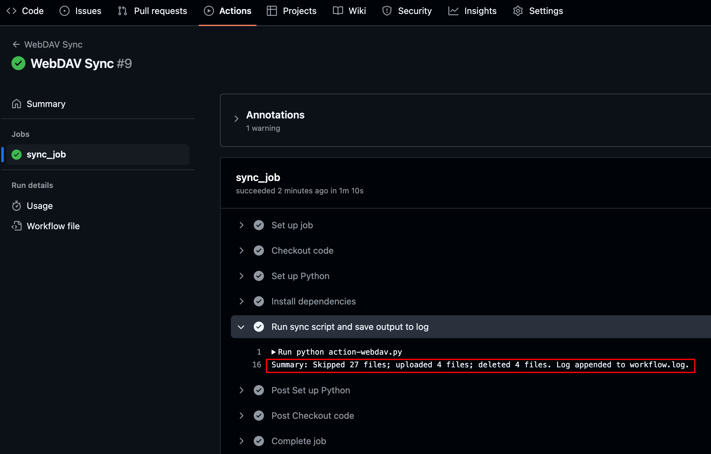
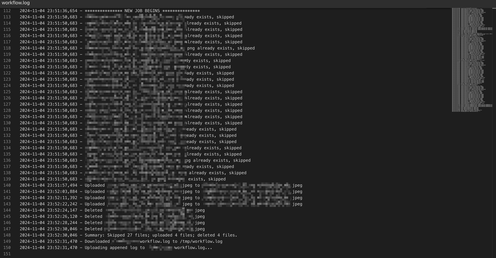

# notion-sync-commission
这是我使用Github的Action功能来同步委托图的仓库. 我的委托图以数据库的形式存储在Notion中(如下图所示), 并且准备了一个能使用WebDAV访问的OneDrive文件夹方便日常查看. 这个仓库中的workflow会每天一次使用Notion API来获取数据库中委托图的信息, 并将本日新增的委托图同步到WebDAV的文件夹中.

## 如果你想使用

1. `fork`此仓库以创建一个自己可以修改的版本. 

   

2. 修改`settings.py`中的过滤条件和文件夹地址等来对应自己的Notion数据库和文件夹. 

3. 通过Notion Integration获取Notion的API Key.

4. 获取WebDAV的账户和密码. 我习惯使用OneDrive, 但OneDrive不直接提供WebDAV, 因此我将OneDrive连接到了Koofr并通过Koofr提供的WebDAV来访问OneDrive. 

5. 转到`Settings`-`Secrets and variables`-`Actions`, 将前两步获取的信息用以下名称添加到Action的环境变量. 

   | Name            | Secret                                                       |
   | --------------- | ------------------------------------------------------------ |
   | WEBDAV_HOSTNAME | WebDAV的url, 如`https://app.koofr.net/dav/OneDrive for Business` (个人版没有"for business") |
   | WEBDAV_LOGIN    | WebDAV的用户名, 一般是邮箱之类的                             |
   | WEBDAV_PASSWORD | 从WebDAV提供商那里获取的密码                                 |
   | DATABASE_ID     | Notion的数据库ID, 一般可以在Notion的url中找到                |
   | NOTION_TOKEN    | 从Notion Integration那里获取的API key                        |

   

6. 转到Actions. 在这里你可以启动Action. 启动之后手动`run workflow`试一下会不会报错. 如果没问题的话, 这个workflow就会在每天的UT 0点自动访问你的Notion数据库并把新出现的图同步到WebDAV文件夹里, 并清除文件夹中多出来的文件. 

7. 运行完之后可以在workflow的详细界面查看输出的文件的变化情况. 

   

   文件变化的细节可以在WebDAV对应文件夹中的`workflow.log`文件中(或自定义的名字)中看到.

   

## 如果有问题

个人感觉这个程序还是挺不稳定的, 可能是因为网络原因吧. 等出了什么具体的问题再看看怎么改进. 

**如果有任何疑问或需要添加的功能请使用Issue询问或直接Pull Request!** 
